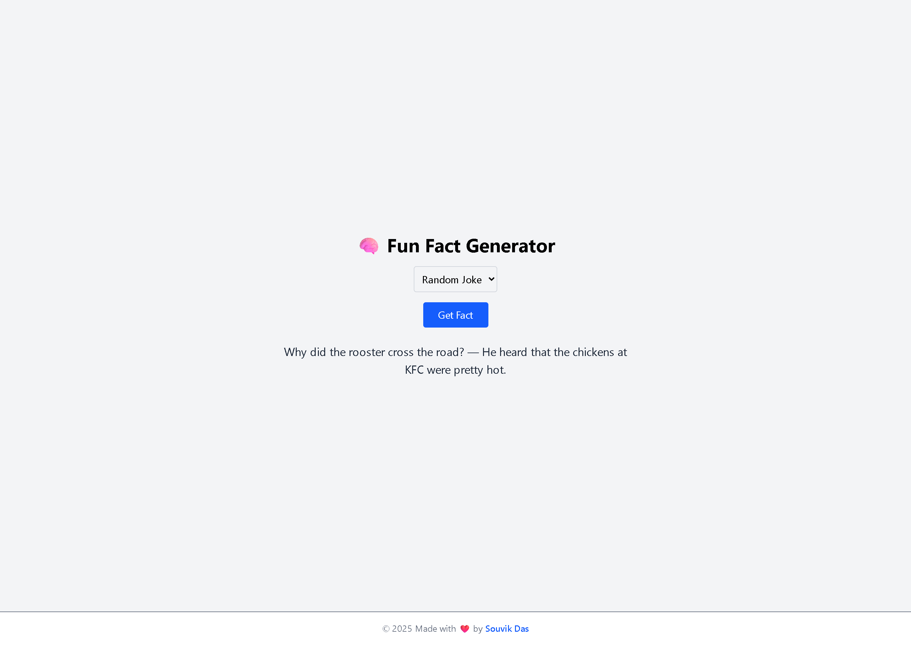

# 🧠 Fun Fact Generator

A simple and interactive React (Vite) web app that fetches fun facts from multiple public APIs. You can choose between Cat Facts, Jokes, Advice, and Trivia — and generate something random with a click!

---

## 🚀 Features

- 🔁 Random facts at your fingertips
- 📚 Supports multiple APIs:
  - Cat Facts
  - Random Jokes
  - Advice
  - Trivia
- ⚡ Built using React + Vite
- 🎨 Styled with Tailwind CSS
- 💬 Async API calls using `fetch` and `async/await`

---

## 🖼️ Preview



---

## 🛠️ Built With

- [React](https://reactjs.org/)
- [Vite](https://vitejs.dev/)
- [Tailwind CSS](https://tailwindcss.com/)
- Public APIs (CatFact, Joke API, Advice Slip, Useless Facts)

---

## 📦 Getting Started

### 1. Clone the repo

```bash
git clone https://github.com/YOUR_USERNAME/fun-fact-generator.git
cd fun-fact-generator
```

### 2. Install dependencies

```bash
npm install
```

### 3. Run the dev server

```bash
npm run dev
```

---

## 🗃️ Project Structure
```kotlin
📦fun-fact-generator
 ┣ 📄 index.html
 ┣ 📄 package.json
 ┣ 📁 src
 ┃ ┣ 📄 App.jsx
 ┃ ┗ 📄 main.jsx
 ┗ 📄 tailwind.config.js
```

---

## 📌 Live Demo
[fun-fact-generator](https://fun-fact-generator-aa63.onrender.com)

---

## 📜 License
This project is licensed under the MIT License — see the [LICENSE](./license) file for details.

## 🙌 Acknowledgements

- [catfact.ninja](https://catfact.ninja/fact)
- [Official Joke API](https://official-joke-api.appspot.com/random_joke)
- [Advice Slip API](https://api.adviceslip.com/advice)
- [Useless Facts](https://uselessfacts.jsph.pl/random.json?language=en)
